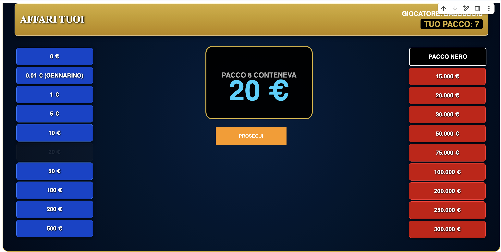

# 📦 Affari Tuoi - Python Interactive Simulator

Un simulatore interattivo completo del celebre game show televisivo **"Affari Tuoi"**, sviluppato interamente in Python. Questo progetto trasforma un notebook Jupyter (come Google Colab) in uno studio virtuale, combinando una solida logica di programmazione a oggetti con un'interfaccia grafica moderna basata su `ipywidgets` e `CSS` personalizzato.

---

## 🛠️ Architettura e Funzionamento

Il simulatore è progettato per offrire un'esperienza fluida e professionale, basandosi su tre pilastri tecnici:

1.  **Interfaccia Grafica (UI/UX)**: Il codice inietta stili CSS personalizzati per gestire un layout a tre colonne con contrasti cromatici ottimizzati. I premi sono divisi in "Blu" (sinistra) e "Rossi" (destra), con aggiornamenti dinamici degli stati (premi scartati o attivi).
2.  **Logica del "Dottore"**: Le offerte monetarie sono generate da un algoritmo che calcola il **Valore Atteso (Expected Value)** dei premi rimasti. Il sistema alterna strategicamente offerte economiche e proposte di **Cambio Pacco** manuale.
3.  **Gestione dello Stato**: Ogni premio è tracciato tramite un **ID univoco** per prevenire errori logici durante la rimozione dei pacchi dal tabellone, garantendo stabilità anche in presenza di importi simili.

---

## 📸 Galleria del Gameplay

### 1. Inizio e Selezione del Pacco
All'avvio, il giocatore viene accolto da un header dorato personalizzato. La griglia centrale permette di scegliere il proprio "Pacco Fortunato".

| Header Dinamico | Griglia di Selezione |
| :---: | :---: |
|  |  |
| *Visualizzazione del giocatore e del pacco in possesso.* | *Selezione iniziale tra i 20 pacchi disponibili.* |

### 2. Fase di Gioco e Reveal
Durante la partita, l'apertura di ogni pacco è accompagnata da un box di "Reveal" centrale ad alta visibilità che svela il premio rimosso dal tabellone.

*Esempio di svelamento di un premio durante il round di gioco.*

### 3. La Strategia del Dottore
Nelle fasi cruciali, il Dottore interviene con offerte calcolate matematicamente per mettere alla prova il giocatore.

*Schermata dell'offerta monetaria generata dinamicamente dal sistema.*

### 4. Il Verdetto Finale
Al termine della sfida, il sistema confronta l'offerta accettata (o il pacco tenuto) con il contenuto originale del pacco scelto all'inizio, calcolando la vincita definitiva.

| Riepilogo Vincita | Verdetto del Pacco |
| :---: | :---: |
|  |  |
| *Visualizzazione della vincita finale ottenuta.* | *Confronto tra premio nel pacco e offerta accettata.* |

---

## 🚀 Tecnologie Utilizzate
* **Python 3**: Logica core e gestione dati.
* **ipywidgets**: Bottoni, griglie interattive e reattività UI.
* **IPython.display**: Rendering di HTML e CSS personalizzato.
* **Statistics & Random**: Algoritmo delle offerte e distribuzione premi.

---

## 📌 Requisiti per l'Esecuzione
Per visualizzare correttamente l'interfaccia grafica, è necessario eseguire il file `.ipynb` in un ambiente che supporti i widget di Jupyter, come:
* **Google Colab** (consigliato)
* **Jupyter Notebook / JupyterLab**
* **VS Code** (con estensione Jupyter)

---
